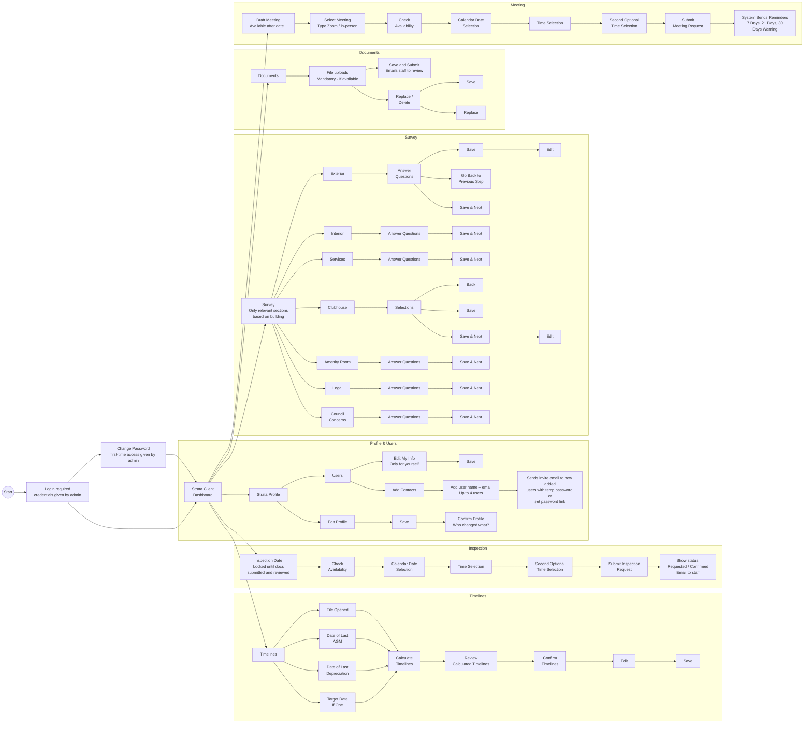
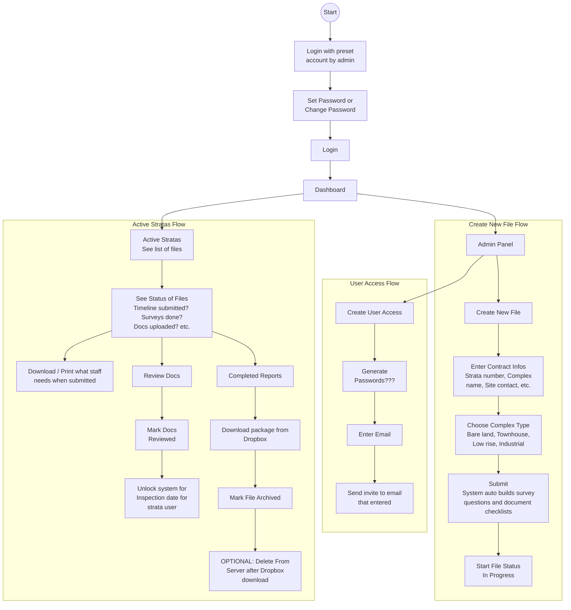
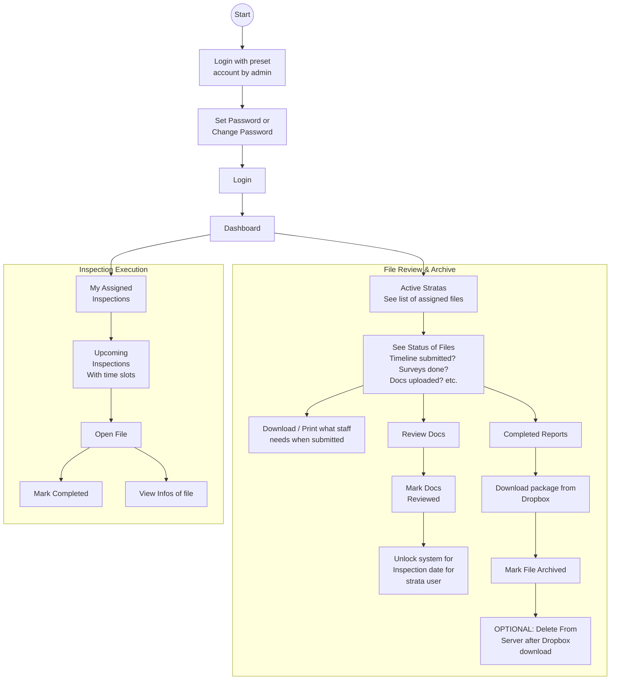
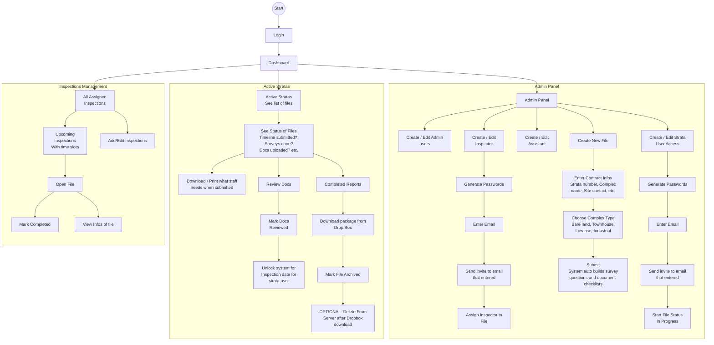

## Client User Flow 

```mermaid
flowchart LR
    %% Main Entry
    Start((Start)) --> Login[Login required\ncredentials given by admin]
    Login --> ChangePW[Change Password\nfirst-time access given by admin]
    ChangePW --> Dashboard[Strata Client\nDashboard]
    Login --> Dashboard

    %% Branch 1: Profile & Users (Yellow/Red)
    subgraph Profile_Management [Profile & Users]
        direction TB
        Dashboard --> StrataProfile[Strata Profile]
        
        StrataProfile --> Users[Users]
        Users --> EditInfo[Edit My Info\nOnly for yourself]
        EditInfo --> SaveInfo[Save]
        
        Users --> AddContacts[Add Contacts]
        AddContacts --> AddUser[Add user name + email\nUp to 4 users]
        AddUser --> SendInvite[Sends invite email to new added\nusers with temp password or\nset password link]
        
        StrataProfile --> EditProfile[Edit Profile]
        EditProfile --> SaveProfile[Save]
        SaveProfile --> ConfirmProfile[Confirm Profile\nWho changed what?]
    end

    %% Branch 2: Timelines (Orange)
    subgraph Timelines_Flow [Timelines]
        direction TB
        Dashboard --> Timelines[Timelines]
        Timelines --> FileOpened[File Opened]
        Timelines --> DateAGM[Date of Last\nAGM]
        Timelines --> DateDepr[Date of Last\nDepreciation]
        Timelines --> TargetDate[Target Date\nIf One]
        
        FileOpened & DateAGM & DateDepr & TargetDate --> CalcTime[Calculate\nTimelines]
        CalcTime --> ReviewCalc[Review\nCalculated Timelines]
        ReviewCalc --> ConfirmTime[Confirm\nTimelines]
        ConfirmTime --> EditTime[Edit]
        EditTime --> SaveTime[Save]
    end

    %% Branch 3: Survey (Green)
    subgraph Survey_Flow [Survey]
        direction TB
        Dashboard --> Survey[Survey\nOnly relevant sections\nbased on building]
        
        Survey --> Exterior[Exterior]
        Survey --> Interior[Interior]
        Survey --> Services[Services]
        Survey --> Clubhouse[Clubhouse]
        Survey --> Amenity[Amenity Room]
        Survey --> Legal[Legal]
        Survey --> Council[Council\nConcerns]
        
        %% Generic Survey Logic (Applied to branches)
        Exterior --> ExtQ[Answer\nQuestions]
        ExtQ --> ExtSave[Save]
        ExtQ --> ExtBack[Go Back to\nPrevious Step]
        ExtQ --> ExtNext[Save & Next]
        ExtSave --> ExtEdit[Edit]

        %% Simplified connections for other survey nodes to avoid clutter
        Interior --> IntQ[Answer Questions] --> IntNext[Save & Next]
        Services --> SvcQ[Answer Questions] --> SvcNext[Save & Next]
        
        Clubhouse --> ClubSel[Selections]
        ClubSel --> ClubBack[Back]
        ClubSel --> ClubSave[Save]
        ClubSel --> ClubNext[Save & Next]
        ClubNext --> ClubEdit[Edit]

        Amenity --> AmQ[Answer Questions] --> AmNext[Save & Next]
        Legal --> LegQ[Answer Questions] --> LegNext[Save & Next]
        Council --> CounQ[Answer Questions] --> CounNext[Save & Next]
    end

    %% Branch 4: Documents (Blue)
    subgraph Documents_Flow [Documents]
        direction TB
        Dashboard --> Docs[Documents]
        Docs --> FileUp[File uploads\nMandatory - If available]
        FileUp --> SaveSub[Save and Submit\nEmails staff to review]
        
        FileUp --> RepDel[Replace /\nDelete]
        RepDel --> SaveDoc[Save]
        RepDel --> ReplaceDoc[Replace]
    end

    %% Branch 5: Inspection (Purple)
    subgraph Inspection_Flow [Inspection]
        direction TB
        Dashboard --> InspDate[Inspection Date\nLocked until docs\nsubmitted and reviewed]
        InspDate --> CheckAvail1[Check\nAvailability]
        CheckAvail1 --> CalDate1[Calendar Date\nSelection]
        CalDate1 --> TimeSel1[Time Selection]
        TimeSel1 --> OptTime1[Second Optional\nTime Selection]
        OptTime1 --> SubInsp[Submit Inspection\nRequest]
        SubInsp --> InspStatus[Show status:\nRequested / Confirmed\nEmail to staff]
    end

    %% Branch 6: Draft Meeting (Pink)
    subgraph Meeting_Flow [Meeting]
        direction TB
        Dashboard --> DraftMeet[Draft Meeting\nAvailable after date...]
        DraftMeet --> SelType[Select Meeting\nType Zoom / in-person]
        SelType --> CheckAvail2[Check\nAvailability]
        CheckAvail2 --> CalDate2[Calendar Date\nSelection]
        CalDate2 --> TimeSel2[Time Selection]
        TimeSel2 --> OptTime2[Second Optional\nTime Selection]
        OptTime2 --> SubMeet[Submit\nMeeting Request]
        SubMeet --> SysRemind[System Sends Reminders\n7 Days, 21 Days, 30\nDays Warning]
    end
```

## Assistant User Flow

```mermaid
flowchart TD
    %% Login Phase
    Start((Start)) --> LoginPreset[Login with preset\naccount by admin]
    LoginPreset --> SetPW[Set Password or\nChange Password]
    SetPW --> Login[Login]
    Login --> Dashboard[Dashboard]

    %% Main Split
    Dashboard --> AdminPanel[Admin Panel]
    Dashboard --> ActiveStratas[Active Stratas\nSee list of files]

    %% Branch 1: Admin Panel - Create New File (Green)
    subgraph Create_File [Create New File Flow]
        direction TB
        AdminPanel --> CreateFile[Create New File]
        CreateFile --> ContractInfo[Enter Contract Infos\nStrata number, Complex\nname, Site contact, etc.]
        ContractInfo --> ComplexType[Choose Complex Type\nBare land, Townhouse,\nLow rise, Industrial]
        ComplexType --> SubmitFile[Submit\nSystem auto builds survey\nquestions and document checklists]
        SubmitFile --> FileStatus[Start File Status\nIn Progress]
    end

    %% Branch 2: Admin Panel - User Access (Purple)
    subgraph User_Access [User Access Flow]
        direction TB
        AdminPanel --> CreateAccess[Create User Access]
        CreateAccess --> GenPW[Generate\nPasswords???]
        GenPW --> EnterEmail[Enter Email]
        EnterEmail --> SendInvite[Send invite to email\nthat entered]
    end

    %% Branch 3: Active Stratas (Blue)
    subgraph Active_Stratas_Flow [Active Stratas Flow]
        direction TB
        ActiveStratas --> FileStatusCheck[See Status of Files\nTimeline submitted? Surveys done?\nDocs uploaded? etc.]
        
        FileStatusCheck --> Download[Download / Print what staff\nneeds when submitted]
        
        FileStatusCheck --> ReviewDocs[Review Docs]
        ReviewDocs --> MarkReviewed[Mark Docs\nReviewed]
        MarkReviewed --> UnlockSys[Unlock system for\nInspection date for\nstrata user]
        
        FileStatusCheck --> CompReports[Completed Reports]
        CompReports --> DLDropbox[Download package from\nDropbox]
        DLDropbox --> MarkArchived[Mark File Archived]
        MarkArchived --> OptDelete[OPTIONAL: Delete From\nServer after Dropbox\ndownload]
    end
```

## Inspector User Flow 

```mermaid
flowchart TD
    %% Login Phase
    Start((Start)) --> LoginPreset[Login with preset\naccount by admin]
    LoginPreset --> SetPW[Set Password or\nChange Password]
    SetPW --> Login[Login]
    Login --> Dashboard[Dashboard]

    %% Main Split
    Dashboard --> ActiveStratas[Active Stratas\nSee list of assigned files]
    Dashboard --> MyInspections[My Assigned\nInspections]

    %% Branch 1: Active Stratas (Blue - Review Logic)
    subgraph Review_Flow [File Review & Archive]
        direction TB
        ActiveStratas --> FileStatus[See Status of Files\nTimeline submitted? Surveys done?\nDocs uploaded? etc.]
        
        FileStatus --> Download[Download / Print what staff\nneeds when submitted]
        
        FileStatus --> ReviewDocs[Review Docs]
        ReviewDocs --> MarkReviewed[Mark Docs\nReviewed]
        MarkReviewed --> UnlockSys[Unlock system for\nInspection date for\nstrata user]
        
        FileStatus --> CompReports[Completed Reports]
        CompReports --> DLDropbox[Download package from\nDropbox]
        DLDropbox --> MarkArchived[Mark File Archived]
        MarkArchived --> OptDelete[OPTIONAL: Delete From\nServer after Dropbox\ndownload]
    end

    %% Branch 2: Assigned Inspections (Purple)
    subgraph Inspection_Execution [Inspection Execution]
        direction TB
        MyInspections --> Upcoming[Upcoming\nInspections\nWith time slots]
        Upcoming --> OpenFile[Open File]
        
        OpenFile --> MarkComp[Mark Completed]
        OpenFile --> ViewInfo[View Infos of file]
    end
```

## Admin User Flow 

```mermaid 
flowchart TD
    %% Login Phase
    Start((Start)) --> Login[Login]
    Login --> Dashboard[Dashboard]

    %% Main Dashboard Split
    Dashboard --> AdminPanel[Admin Panel]
    Dashboard --> ActiveStratas[Active Stratas\nSee list of files]
    Dashboard --> AllInspections[All Assigned\nInspections]

    %% --- ADMIN PANEL COLUMNS ---
    subgraph Admin_Panel_Actions [Admin Panel]
        direction TB
        
        %% Column 1: Admin Users
        AdminPanel --> CreateAdmin[Create / Edit Admin\nusers]

        %% Column 2: Inspector (Green-ish)
        AdminPanel --> CreateInsp[Create / Edit\nInspector]
        CreateInsp --> GenPW_Insp[Generate Passwords]
        GenPW_Insp --> Email_Insp[Enter Email]
        Email_Insp --> Invite_Insp[Send invite to email\nthat entered]
        Invite_Insp --> Assign_Insp[Assign Inspector to\nFile]

        %% Column 3: Assistant (Pink)
        AdminPanel --> CreateAssist[Create / Edit\nAssistant]

        %% Column 4: New File (Green)
        AdminPanel --> CreateFile[Create New File]
        CreateFile --> ContractInfo[Enter Contract Infos\nStrata number, Complex\nname, Site contact, etc.]
        ContractInfo --> ComplexType[Choose Complex Type\nBare land, Townhouse,\nLow rise, Industrial]
        ComplexType --> SubmitFile[Submit\nSystem auto builds survey\nquestions and document checklists]

        %% Column 5: Strata User Access (Purple)
        AdminPanel --> CreateStrataUser[Create / Edit Strata\nUser Access]
        CreateStrataUser --> GenPW_Strata[Generate Passwords]
        GenPW_Strata --> Email_Strata[Enter Email]
        Email_Strata --> Invite_Strata[Send invite to email\nthat entered]
        Invite_Strata --> FileStatus[Start File Status\nIn Progress]
    end

    %% --- ACTIVE STRATAS ---
    subgraph Active_Stratas_Flow [Active Stratas]
        direction TB
        ActiveStratas --> FileStatusCheck[See Status of Files\nTimeline submitted? Surveys done?\nDocs uploaded? etc.]
        
        FileStatusCheck --> Download[Download / Print what staff\nneeds when submitted]
        
        FileStatusCheck --> ReviewDocs[Review Docs]
        ReviewDocs --> MarkReviewed[Mark Docs\nReviewed]
        MarkReviewed --> UnlockSys[Unlock system for\nInspection date for\nstrata user]
        
        FileStatusCheck --> CompReports[Completed Reports]
        CompReports --> DLDropbox[Download package from\nDrop Box]
        DLDropbox --> MarkArchived[Mark File Archived]
        MarkArchived --> OptDelete[OPTIONAL: Delete From\nServer after Dropbox\ndownload]
    end

    %% --- ALL ASSIGNED INSPECTIONS ---
    subgraph Inspections_Flow [Inspections Management]
        direction TB
        AllInspections --> Upcoming[Upcoming\nInspections\nWith time slots]
        AllInspections --> AddEditInsp[Add/Edit Inspections]
        
        Upcoming --> OpenFile[Open File]
        OpenFile --> MarkComp[Mark Completed]
        OpenFile --> ViewInfo[View Infos of file]
    end
```

