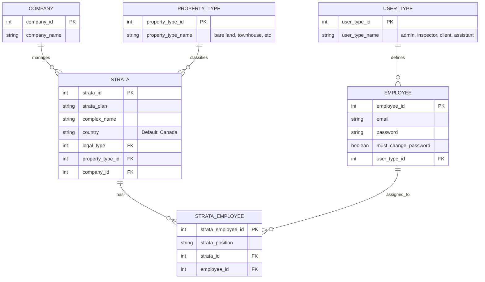
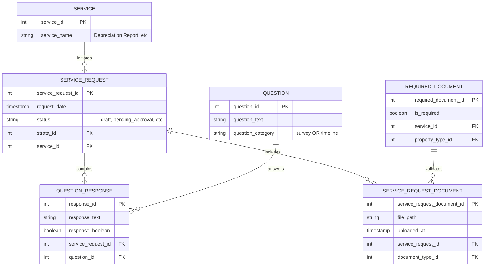
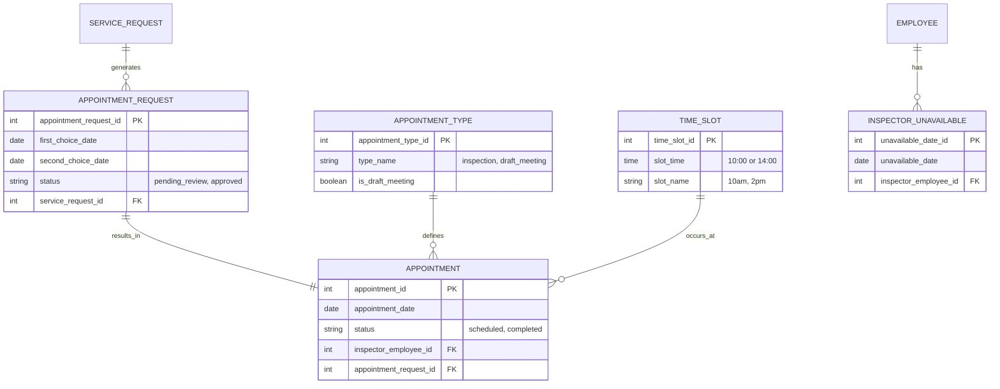
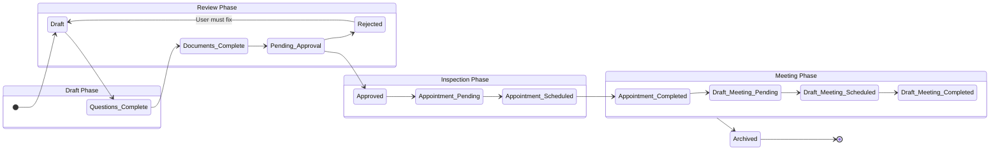
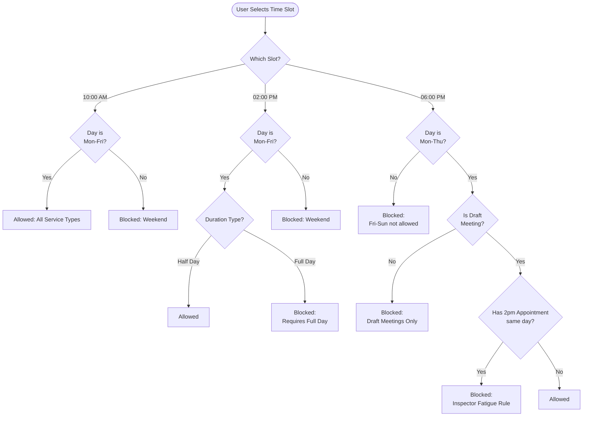
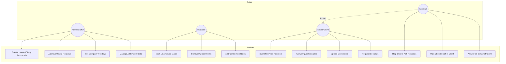
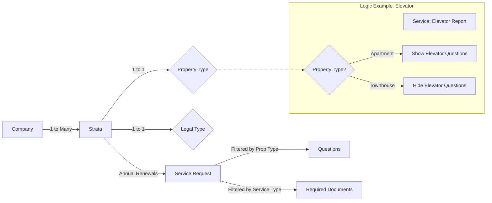

## 1. Core Users & Stratas Structure



## 2. Surveys & Documents Logic



## 3. Appointments & Scheduling 



## 4. Business Rules: Status Flow (The "Cannot Skip Steps" Rule) 



## 5. Business Rules: Appointment Slot Logic 



## 6. Business Rules: Inspector Availability Constraints 

```mermaid  
flowchart TD
    subgraph Availability_Check [Availability Algorithm]
        direction TB
        Request[New Appointment Request] --> Check1{Is Weekend?}
        Check1 -- Yes --> Deny[Unavailable]
        Check1 -- No --> Check2{Is Company Holiday?}
        
        Check2 -- Yes --> Deny
        Check2 -- No --> Check3{Inspector Marked\nUnavailable?}
        
        Check3 -- Yes --> Deny
        Check3 -- No --> Check4{Slot Already Booked?}
        
        Check4 -- Yes --> Deny
        Check4 -- No --> Check5{City Constraint\n(Travel Logic)}
        
        Check5 -- "Different City than\nother appts that day" --> Deny
        Check5 -- "Same City OR\nNo other appts" --> Approve[Available]
    end
```
 
## 7. Permissions & Roles Matrix 



## 8. Data Connection Rules



